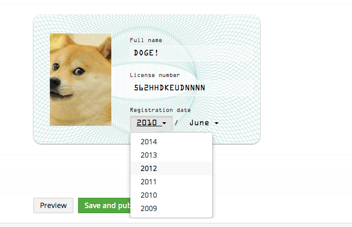

# Drivers License Editor

Editor to edit drivers license deatails, built using Warren Buckley's excellent [yeoman umbraco generator](https://github.com/warrenbuckley/generator-umbraco).

####This is just a proof of concept editor, should not be used in production, and does not follow the umbraco UI guidelines, but simply shows that you can do whatever you want...




## Setup
Make sure you have node, npm and grunt installed. runt `grunt` to build the editor and copy the /dist/ folder into the root of an umbraco install. This will create /app_plugins/driverslicenseeditor/ folder which holds all editor related files. 

To build directly to an umbraco install, simply run: 

```bash
grunt --target=/path/to/website
```


### Install Dependencies

```bash
npm install -g grunt-cli
npm install
```

### Build

```bash
grunt
```

### Watch

```bash
grunt watch
```

### Test
To unit test the controller, you must first tell it where to get all the core umbraco .js files, simply point it at a /umbraco/ folder of a downloaded umbraco install, you only need to do this once. 

```bash
grunt test --target=/path/to/website/umbraco/
grunt test
```
